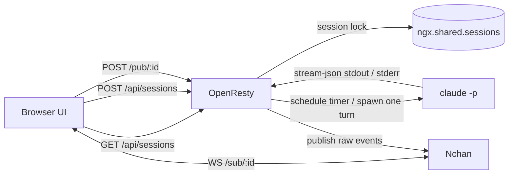

# Claude Workspace

Claude Workspace is a session-based Claude workspace built on OpenResty + Nchan.

The current implementation is intentionally CGI-like:

- OpenResty handles long-lived browser subscriptions through Nchan.
- Claude is started per turn, not kept alive as a daemon.
- Each turn is launched asynchronously from `ngx.timer.at(...)`, outside the request lifecycle.
- OpenResty only enforces a session-level lock so a single session never runs two Claude turns at once.
- The browser handles simple input queuing and session switching.

## Architecture

## Request Flow

1. The browser creates or selects a session.
2. The browser keeps a WebSocket subscription open to `/sub/:id`.
3. When the user sends a message, the browser POSTs to `/pub/:id`.
4. OpenResty acquires a lock for that `session_id`.
5. OpenResty schedules a timer callback, which launches one Claude turn outside the request lifecycle.
6. Claude emits raw `stream-json` events.
7. OpenResty forwards those events to Nchan unchanged.
8. The browser receives the raw `stream-json` stream from the subscribed session.

## Why This Shape

This repository originally tried to keep a long-lived Claude subprocess inside OpenResty. That is brittle because worker restarts and request lifetimes are a poor fit for persistent subprocess supervision.

The current model keeps responsibilities separate:

- OpenResty: routing, locking, publishing, and subscribing
- Nchan: long-lived transport and buffering
- Claude: single-turn execution
- Frontend: UI state and lightweight queuing

## Session Semantics

The public concept is `session_id` only:

- A session is created with a UUID `session_id`
- `/pub/:id` and `/sub/:id` use the same UUID
- The UI displays only `session_id`
- Internally, there is no separate “channel” abstraction in the app code

In practice:

- `session_id` is the only session identifier users need to know
- The same UUID is reused for routing and session state

## Session Lock

OpenResty uses a shared-dictionary lock to ensure only one Claude turn runs at a time per session.

Behavior:

- If the lock is free, a turn can start.
- If the lock is held, the server returns `409 session busy`.
- The browser may queue input locally.
- The lock is released when the turn exits or fails.

## Endpoints

- `POST /api/sessions` creates a session record.
- `GET /api/sessions` lists sessions.
- `GET /api/sessions/:id` returns session metadata.
- `DELETE /api/sessions/:id` deletes an idle session record.
- `POST /pub/:id` submits one Claude turn.
- `GET /sub/:id` is the Nchan subscription endpoint.

## Runtime Details

- Claude is launched with `--print`, `--input-format stream-json`, and `--output-format stream-json`.
- The turn is timer-driven and does not inherit the HTTP request lifetime.
- The first turn starts without `--session-id`; Claude returns its own `session_id`.
- Later turns use `--resume <claude_session_id>` to continue the same Claude conversation.
- The UI subscribes to the raw `stream-json` stream, not a custom backend format.

## UI

The frontend is a terminal-like layout inspired by Claude TUI:

- A collapsible session list on the left
- A message stream on the right
- A fixed input area at the bottom
- An Action Console that is collapsed by default
- Auto-scroll to the latest message

## Nchan Buffering

For now, the app uses Nchan’s built-in in-memory buffering:

- The current session history can be replayed
- Refreshing the page can restore the current session subscription

Redis persistence is deferred to TODO.

## TODO

- Persist Nchan session history into Redis
- Rehydrate history from Redis on reconnect
- Add a more complete browser retry policy for `409 session busy`
- Continue tightening the UI toward Claude TUI
