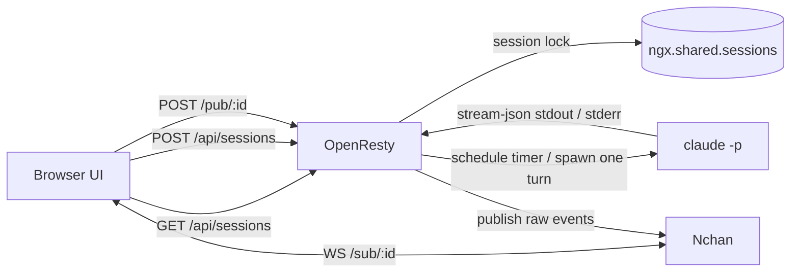

# Claude Workspace

Claude Workspace 是一个基于 OpenResty + Nchan 的会话式 Claude 工作区。

当前实现采用的是 **CGI-like turn** 模式：

- OpenResty 负责 Nchan 长连接和 HTTP 路由。
- Claude 不常驻，每一轮 turn 都单独启动一次。
- turn 通过 `ngx.timer.at(...)` 异步触发，脱离请求生命周期。
- OpenResty 只负责 session 级别的互斥锁，避免同一会话并发跑两个 Claude。
- 前端负责简单的输入排队和会话切换。

## 架构

## 请求流程

1. 浏览器创建或选择一个会话。
2. 浏览器保持对 `/sub/:id` 的 WebSocket 订阅。
3. 用户发送消息时，浏览器 `POST /pub/:id`。
4. OpenResty 为该 `session_id` 申请锁。
5. OpenResty 用 timer 回调启动一次 Claude turn，脱离请求生命周期。
6. Claude 使用 `stream-json` 输出原始事件。
7. OpenResty 原样转发这些事件到 Nchan。
8. 浏览器从订阅的 session 流里收到原始 `stream-json`。

## 为什么这样设计

这个仓库最早尝试把长生命周期的 Claude 子进程放进 OpenResty 内部管理，但那种方式和 worker 生命周期并不匹配，容易被重载、重连和请求上下文影响。

现在的模型把职责拆开：

- OpenResty 负责路由、锁、发布和订阅
- Nchan 负责长连接和消息通道
- Claude 负责单轮计算
- 前端负责 UI 状态和简单队列

## Session 语义

现在对外统一只使用 `session_id`：

- 创建会话时直接生成 `session_id`
- `/pub/:id` 和 `/sub/:id` 都使用同一个 UUID
- UI 只显示 `session_id`
- 内部实现里不再单独维护“channel”这一层抽象

换句话说：

- `session_id` 就是唯一的会话标识
- 对用户来说只有一个概念
- 对后端来说只是同一个 UUID 的不同使用场景

## session 锁

OpenResty 使用共享字典里的锁来保证一个 session 同一时间只跑一个 turn。

行为如下：

- 锁空闲时，允许启动 turn
- 锁被占用时，返回 `409 session busy`
- 前端可以选择把输入排队
- turn 结束或失败后释放锁

## 接口

- `POST /api/sessions` 创建会话记录。
- `GET /api/sessions` 列出会话。
- `GET /api/sessions/:id` 返回会话元数据。
- `DELETE /api/sessions/:id` 删除空闲会话。
- `POST /pub/:id` 提交一次 Claude turn。
- `GET /sub/:id` 是 Nchan 订阅端点。

## 运行细节

- Claude 以 `--print`、`--input-format stream-json`、`--output-format stream-json` 启动。
- turn 是 timer 驱动的，不继承 HTTP 请求生命周期。
- 第一轮不传 `--session-id`，Claude 会返回自己的 `session_id`。
- 后续 turn 使用 `--resume <claude_session_id>` 继续同一条 Claude 会话。
- UI 订阅到的是原始 `stream-json`，不是后端定制格式。

## UI

前端是一个接近 Claude TUI 的终端式布局：

- 左侧是可折叠 session 列表
- 右侧是消息流
- 输入区固定在底部
- Action Console 默认收起
- 消息流支持自动滚动到最新

## Nchan 持久化

当前先使用 Nchan 自带的内存 buffer：

- 当前 session 的历史可以回放
- 刷新后可以恢复当前 session 的订阅

Redis 持久化已经留在 TODO 中。

## TODO

- 将 Nchan 的会话历史持久化到 Redis
- 重连时从 Redis 恢复历史事件
- 给 `409 session busy` 增加更完整的浏览器重试策略
- 继续收敛 UI 的 Claude TUI 风格
